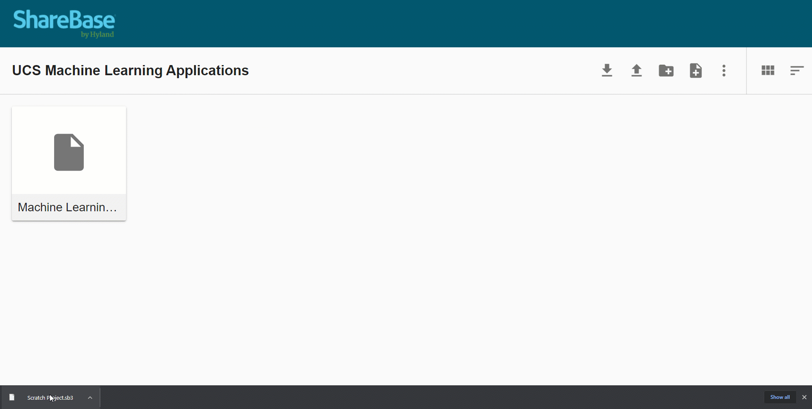

## Sharing Applications
Follow the steps below to share your machine learning Scratch applications.

1. In Scratch, open "File" menu in the top left
1. Select the "Save to your computer" option  
	
1. In a new tab, open the [UCS Machine Learning Applications Folder](https://app.sharebase.com/#/folder/1505663/share/3-m--Flnk5tzSM4lekibbNzAtEo0I)
1. Drag the downloaded application file into the folder  
	

To view other applications, download the **.sb3** files and open them in Scratch 3!