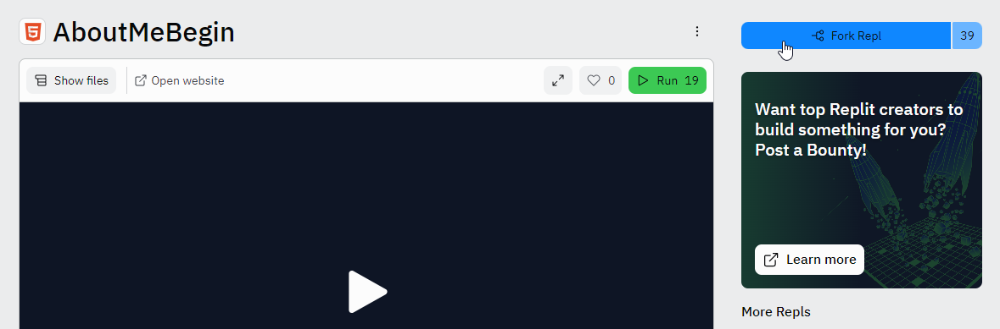

# About Me: Code-Along
With this exercise, you will create a webpage that shows some information about yourself.

## Making a Repl Account
Before beginning, make sure you have a Repl account. You can follow [these instructions](https://hylandtechclub.com/ReplitSetup) to set one up if you do not have one.

## Getting Started
Start by creating a **Fork** of an empty project to get started.

1. Go to [this empty Project](https://replit.com/@HylandOutreach/AboutMeBegin?v=1)
1. Click the "Fork Repl" button in the upper right  
    

## HTML Setup
Now everything should be ready to go. Start by creating a simple HTML document containing a header.

1. In the **index.html** file, add the `<html></html>` opening and closing tag
1. Inside of the `<html>` and `</html>`, add the `<body></body>` opening and closing tag
1. Inside of the `<body>` and `</body>`, add a `<h1></h1>` header tag that says "About Me"
1. Click the **Run** button to make sure your page is working!

At the end of the **Setup**, your code should look like this (try to match the spacing):
```html
<html>
    <body>
        <h1>About Me</h1>
    </body>
</html>
```

## Greeting and Basic Information
Next, add some additional information to the webpage.

1. Under the `h1` header tag, add in a `<p></p>` paragraph tag welcoming the user to your page
1. Add another paragraph containing your name
1. Add another paragraph containing your grade level
1. Add another paragraph containing your favorite thing to do

At the end of this section, your code should look something like this:
```html
<html>
    <body>
        <h1>About Me</h1>

        <p>Welcome to my page!</p>
        <p>My name is Arthur Read</p>
        <p>I am in 3rd grade</p>
        <p>I like to play with my dog</p>
    </body>
</html>
```

## Favorite Animal
Add in a picture of your favorite animal.

1. Under the last `p` paragraph tag, add a smaller `h3` header that says "Favorite Animal"
1. Add an image of your favorite animal
    1. Find an animal in the Repl project `animals` folder
    1. Add an `` image tag under the `h3` header
    1. Set the `src` of the image to `animals/` plus the image name, all in quotes

### Using a New Picture
If none of the pictures in the `animals` folder will work, it is also possible to add another picture!

1. Open a new tab, but make sure to keep the Replit project open too
1. In the new tab, go to [google images](https://images.google.com/)
1. Search for an animal you would like on your webpage (e.g., a koala)
1. Click on the image, and make sure it fully loads on the right side of the page
1. When it has loaded, right click it, and select "Save image as..."
1. Enter a good name for the image (e.g., "koala.jpg")
1. Switch back to the Replit project tab
1. Drag the newly saved image from the bottom of the page into the `animals` folder
1. Now the image can be used in your project!


## Final HTML
The code should look something like this:

```html
<html>
    <body>
        <h1>About Me</h1>

        <p>Welcome to my page!</p>
        <p>My name is Arthur Read</p>
        <p>I am in 3rd grade</p>
        <p>I like to play with my dog</p>

        <h3>Favorite Animal</h3>
        
    </body>
</html>
```
