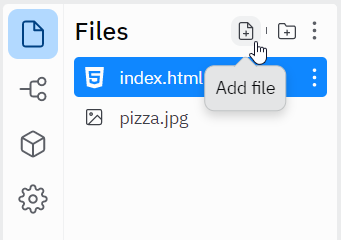

# Multiple Pages Demonstration
Follow these instructions to see how to create multiple website pages by creating multiple HTML files and connecting them with links!

## Creating the File
Start by creating the new HTML file.

1. Open the full Restaurant Website Repl project  
    - If necessary, remix [this project](https://replit.com/@HylandOutreach/RestaurantWebsiteFull#index.html)
1. In the Repl project, create a new file by clicking the "Add File" button  
    
1. Name the file **page2.html**  
    
    - Note that the file _must_ end with **.html** for this to work

That's it! There is now a new HTML file in the project.

## Updating the File
Update the **page2.html** file to give it some basic content.

1. Open the **page2.html** file for editing
1. Add the `<html></html>` element
1. Within the `<html>` and `</html>`, add the `<body></body>` element
1. Within the `<body>` and `</body>`, add an `<h1></h1>` element that says "More Info"
1. Under the `<h1></h1>` element, within the `body`, add a `<p></p>` element that says "Alfredo's Pizza Cafe was founded in 1989."

The code in the **page2.html** file should look something like this:

```html
<html>
  <body>
    <h1>More Info</h1>
    <p>Alfredo's Pizza Cafe was founded in 1989.</p>
  </body>
</html>
```

At this point, to actually view this file, it will be necessary to open the Webview in a new tab by clicking the "Open in a new tab" button:


From there, append `/page2.html` to the end of the website URL to view the new page!


## Adding a Link to the File
The next step is to make it possible to actually view the new page from the main page!

1. In the Repl project, open the **index.html** file for editing
1. Find the `<a>` element right above the `</body>`
1. Under the `<a>`, above the `</body>`, create an `<h3></h3>` element  
    - It should say "More Info"
1. Under the `<h3>`, create an `<a></a>` element
1. Set the `href` attribute of the `<a>` element to be `"page2.html"`
1. Set the content of the `<a>` to say "Click here"

The additional code in the **index.html** file should look something like this:

```html
<h3>More Info</h3>
<a href="page2.html">Click here</a>
```

Run the site, and make sure that clicking the link makes the new page appear!

## Adding a Link Back Home
Now, the new page is up and running, but there's not a way to go back to the main page! Fix this by adding another `<a></a>` element to **page2.html**.

1. Open the **page2.html** file for editing
1. Find the `<p>` element right above the `</body>`
1. Under the `<p>`, above the `</body>`, create an `<a></a>` element
1. Set the `href` attribute of the `<a>` element to be `"index.html"`
1. Set the content of the `<a>` to say "Go back home"

The additional code in the **page2.html** file should look something like this:

```html
<a href="index.html">Go back home</a>
```

Run the site, visit the new page, and make sure that clicking "Go back home" navigates back to the main page!

## Conclusion
Adding multiple pages to a website can make it much more user-friendly and expansive. Feel free to incorporate multiple pages into any future projects as desired!

[Click here for a full version of this multi-page project on Replit.](https://replit.com/@HylandOutreach/RestaurantWebsiteFullAgain)
