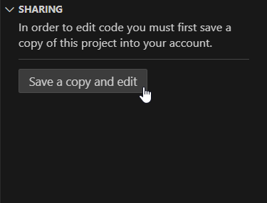

# More HTML Practice
This week, you can keep working on your websites!

## Find Your Projects
**[Click here to go to the My Projects page.](https://vscodeedu.com/my-work/projects)**

If you are logged into [VS Code for Education](https://vscodeedu.com/), it should show you all the code you have already written!

## Make a New Project
**[Click here for a new starter project.](https://vscodeedu.com/9PVuag6hDfE6U4sdd8tt)**

Make sure you sign in, and click the "Save a copy and edit" button in the lower left:

Then, change the website to be whatever you want it to be!

## Ideas
[Click here for some ideas about what you can do on your website.](Ideas.md)
Add more pictures

Change the font

