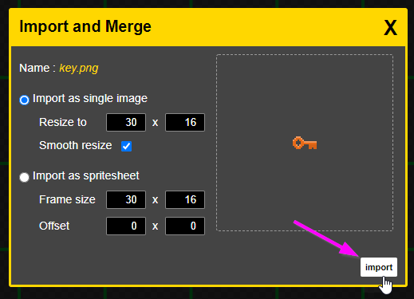
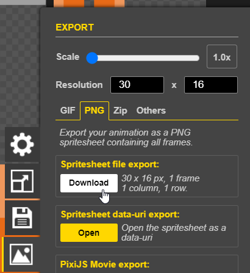
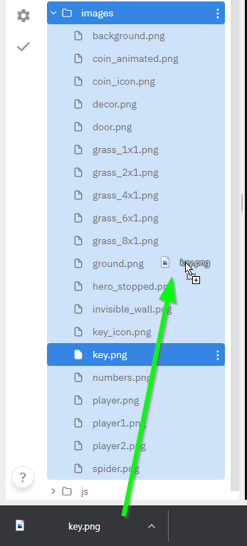
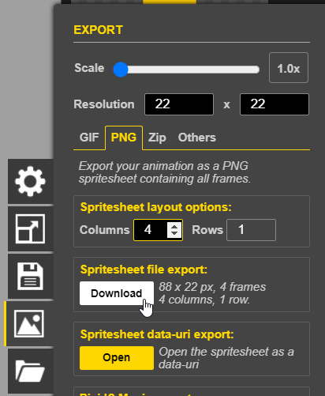
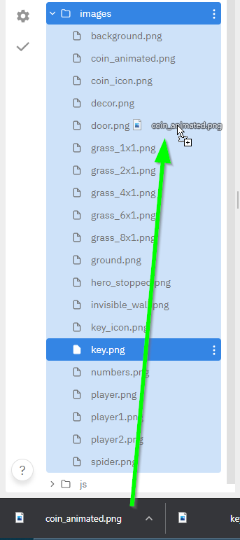
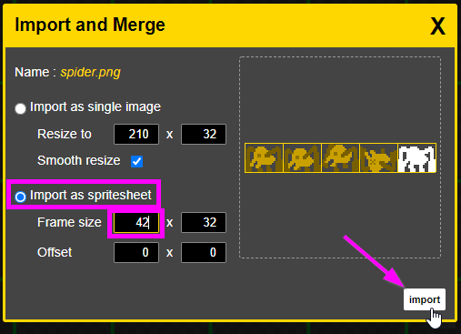
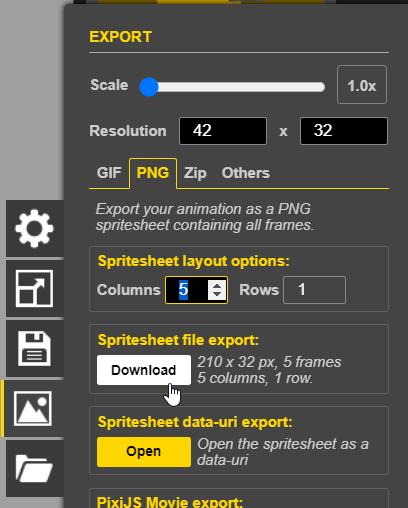
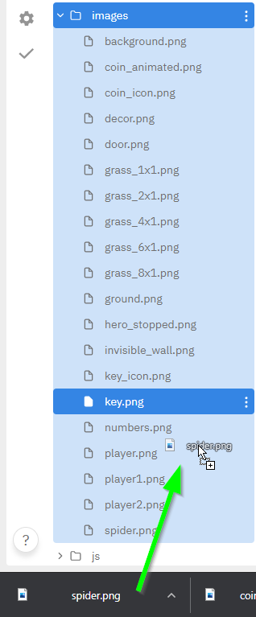
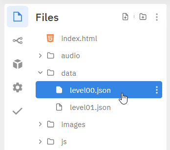
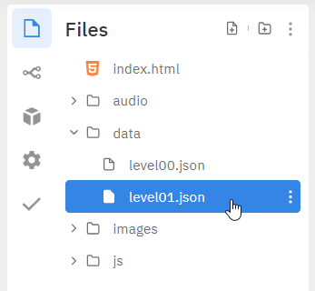

# Animation Challenges
After completing the [Game Animation Follow-Along](GameAnimation.md), work on some of these challenges. There are a few different options; feel free to get creative and do whatever you want to do with Piskel and/or the platformer game!

Click the links below to scroll to one of the options on this page.

- [Option 1: A Totally New Sprite](#option-1-a-totally-new-sprite)
- [Option 2: Updating the Existing Game Art](#option-2-updating-the-existing-game-art)
- [Option 3: Updating the Existing Game Code](#option-3-updating-the-existing-game-code)

## Option 1: A Totally New Sprite
Go to [Piskel](https://www.piskelapp.com/) and work on creating a new sprite of any kind. This could be a character, an enemy, a background element, or a completely abstract work of art! Try to add multiple frames to make it into an animation.

This challenge can be completed in Piskel without doing anything with the existing game.

## Option 2: Updating the Existing Game Art
Similar to how the player was replaced with a new Piskel animation, replace some of the other game assets.

#### Tips
If you are running into any issues, make sure to abide by these rules:

- Do not change the size of the canvas for one of the existing Piskel sprites
- Do not change the number of frames for an existing sprite
- Export each Piskel as a PNG
- Export with the appropriate number of columns in the spritesheet
  - The number of columns should be the same as the number of frames
- Make sure each filename is correct
- Drag the new **.png** files into the "images" folder

### Key
Replace the key sprite in the game with a new one.

#### Importing the Existing Key
Follow the steps below to import the key sprite.


1. Right click the picture above and select "Save image as..."
1. Save the image on your computer with **key.png** as the name
1. Open a new web browser tab, and go to [www.piskelapp.com](https://www.piskelapp.com)
1. Click the "Create Sprite" button  
    
1. In the sprite editor, on the right, click the "IMPORT" folder icon  
    
1. In the menu that appears, click the "Browse images" button  
    
1. Find the saved **key.png** file and select it for opening
1. Click the "import" button  
    
1. If a pop-up appears asking if you want to continue, click the "OK" button

Now the key sprite should be ready for editing!

#### Modifying the Key
Now, the next step is to update the key sprite a little bit.

1. Make any changes to the sprite
1. Export the new PNG file for the key  
    
1. Save the file as **key.png**
1. Open the Repl project
1. Drag the **key.png** file into the "images" folder  
    
1. Click the "Replace" button to replace the existing file
1. Run the game, and verify that the new key appears!

### Coin
Replace the coin sprite in the game with a new one.

#### Importing the Existing Coin
Follow the steps below to import the coin sprite.


1. Right click the picture above and select "Save image as..."
1. Save the image on your computer with **coin_animated.png** as the name
1. Open a new web browser tab, and go to [www.piskelapp.com](https://www.piskelapp.com)
1. Click the "Create Sprite" button  
    
1. In the sprite editor, on the right, click the "IMPORT" folder icon  
    
1. In the menu that appears, click the "Browse images" button  
    
1. Find the saved **coin_animated.png** file and select it for opening
1. Select the "Import as spritesheet" option  
1. Set the Frame size to 22 x 22
1. Click the "import" button  
    
1. If a pop-up appears asking if you want to continue, click the "OK" button

Now the four frames of the coin sprite should be ready for editing!

#### Modifying the Coin
Now, the next step is to update the coin sprite a little bit.

1. Make any changes to the sprite
    - Make sure to update all frames
1. Export the new PNG file for the coin animation
    - Make sure there are **4 columns** for the spritesheet  
    
1. Save the file as **coin_animated.png**
1. Open the Repl project
1. Drag the **coin_animated.png** file into the "images" folder  
    
1. Overwrite the existing file by clicking "Replace"
1. Run the game, and verify that the new coin appears!

### Spider
Replace the spider sprite in the game with a new one.

#### Importing the Existing Spider
Follow the steps below to import the spider sprite.


1. Right click the picture above and select "Save image as..."
1. Save the image on your computer with **spider.png** as the name
1. Open a new web browser tab, and go to [www.piskelapp.com](https://www.piskelapp.com)
1. Click the "Create Sprite" button  
    
1. In the sprite editor, on the right, click the "IMPORT" folder icon  
    
1. In the menu that appears, click the "Browse images" button  
    
1. Find the saved **spider.png** file and select it for opening
1. Select the "Import as spritesheet" option  
1. Set the Frame size to 42 x 32
1. Click the "import" button  
    
1. If a pop-up appears asking if you want to continue, click the "OK" button

Now the four frames of the spider sprite should be ready for editing!

#### Modifying the Spider
Now, the next step is to update the spider sprite a little bit.

1. Make any changes to the sprite
    - Make sure to update all frames
1. Export the new PNG file for the spider animation
    - Make sure there are **5 columns** for the spritesheet  
    
1. Save the file as **spider.png**
1. Open the Repl project
1. Drag the **spider.png** file into the "images" folder  
    
1. Overwrite the existing file by clicking "Replace"
1. Run the game, and verify that the new spider appears!

## Option 3: Updating the Existing Game Code
Hack some of the code to change the actual gameplay for the game.

### Gameplay Settings
There are some _variables_ in the game code that control how the game works. In computer science, variables are containers for data that can change. Play around with them for some interesting results.

#### Setup
First, open the proper file.

1. Open the Repl project with the game
1. In the "Files" area on the left, open the "js" folder
1. From there, open the **main.js** file  


#### Coding
Take a look at the code at the top of the file, the first 10 lines:

```js
// =============================================================================
// Gameplay Settings
// =============================================================================

const JUMP_SPEED = 400;
const SPEED = 200;
const RUN_FPS = 8;
Spider.SPEED = 100;
const COIN_FPS = 5;
const GRAVITY = 1200;
```

This code may be readable even if you have never seen code before! It sets some values that update the gameplay.

1. Try changing the `JUMP_SPEED` value from `400` to something else (like `800`)
1. Run the game, and see how the player jumps differently
1. Try changing the `SPEED` value from `200` to something else (like `100`)
1. Run the game, and see how the player runs differently
1. Try changing the other values, and see what they do when the game is run!

### Level Creation
All of the levels in the game come from code files. These files tell the game where to place different objects, like the main character, the coins, the key, etc.

#### Level 0
Start with the first level in the game, level 0. Open the "data" folder and the **level00.json** file to get started.



The code in this file is in a format called [JSON](https://en.wikipedia.org/wiki/JSON). It is a way to represent data, but do not worry too much about how it all works for this exercise. Take a look at the code, and try to figure out what it does.

Each sprite in the game is being placed on the map using `x` and `y` values. This is similar to the [cartesian plane](https://en.wikipedia.org/wiki/Cartesian_coordinate_system) from mathematics. The `x` value represents the horizontal position, and the `y` value represents the vertical position.

#### Updating the Player Starting Position
In the **level00.json** file, find where the `"hero"` is set. The code looks like this:

```js
"hero": {"x": 21, "y": 525},
```

Try changing `x` value from `21` to `300`. Then, run the game. The player's starting position should update; it should be further to the right!

See what happens if the `y` value is changed. Note that unlike the mathematic cartesian plane, `y` values get bigger as they go down. So changing the value from `525` to something like `200` would make the player start higher up in the game.

#### Changing Values
Mess around with all of the values in the file. See if you can make the game a little more challenging for the player, or perhaps even impossible to win!

#### Challenge - Adding a Coin
In the **level00.json** file, find where the `"coins"` are set. The code looks like this:

```js
"coins": [
    {"x": 147, "y": 525}, {"x": 189, "y": 525},
    {"x": 399, "y": 399}, {"x": 357, "y": 420}, {"x": 336, "y": 462},
    {"x": 819, "y": 525}, {"x": 861, "y": 525}, {"x": 903, "y": 525}
],
```

For this example, there are actually multiple coins being added to the game! They each have this structure:

```js
{"x": 147, "y": 525}
```

Try to add an additional coin. Add a comma at the end of the last coin added, and then add the new coin location. Make sure the last coin location in the list does not end with a comma, otherwise it will not work!

Make sure the commas, curly brackets, double quotes, colons, and values are all in the proper place.

### Level 01
Next, move onto the second level in the game, level 1. Open the "data" folder and the **level01.json** file to get started.



This file has the same format, but it has a few more objects for the game.

#### Removing a Spider
As it stands, this level is a little too difficult. Make it easier by removing one of the spiders.

First, locate the code in the file where the `"spiders"` are generated. It looks like this:

```js
"spiders": [
    {"x": 121, "y": 399},
    {"x": 800, "y": 362},
    {"x": 500, "y": 147}
],
```

Remove the middle one from the list. Note that there should be _no_ comma after the last location in the list, but there _should_ be a comma after every other location. Run the game, and verify that one of the spiders has disappeared!

#### Challenge - Changing the Key Position
Even with the spider removed, this level seems too difficult. Change the position of the key so that it appears right next to the door, making it very easy to win.

1. Find where the `"key"` position is set
1. Change the `"x"` and `"y"` values for the key

### Beyond
After completing some of the basic level challenges, try to do more! Design a totally new level, and try to make it fun for the player.