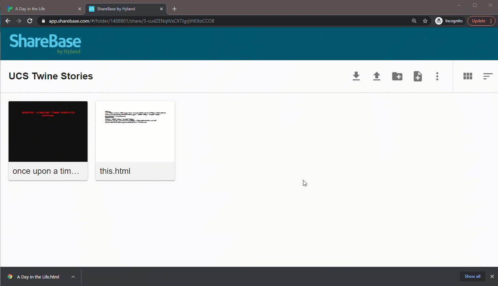

## Sharing Stories
One of the best parts of creating stories is sharing them with others! When you want to share, follow these steps:

1. In Twine, open the story menu on the bottom left
1. Select the "Publish to File" option  
	
1. Choose a folder for the download, and click "Save"  
	
1. In a new tab, open the [UCS Twine Stories Folder](https://app.sharebase.com/#/folder/1488801/share/3-cudZENqtVsCX7JgrjVtKItoCCO8)
1. Drag the downloaded story file into the folder  
	

To view other stories, download them from the folder and open them in a web browser!